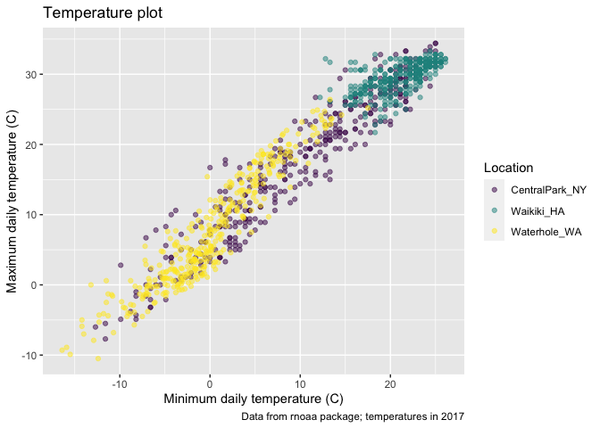

viz\_ii
================
Murrel Pereira
10/5/2020

\#\#Load the weather data

``` r
weather_df = 
  rnoaa::meteo_pull_monitors(
    c("USW00094728", "USC00519397", "USS0023B17S"),
    var = c("PRCP", "TMIN", "TMAX"), 
    date_min = "2017-01-01",
    date_max = "2017-12-31") %>%
  mutate(
    name = recode(
      id, 
      USW00094728 = "CentralPark_NY", 
      USC00519397 = "Waikiki_HA",
      USS0023B17S = "Waterhole_WA"),
    tmin = tmin / 10,
    tmax = tmax / 10) %>%
  select(name, id, everything()
  )
```

    ## Registered S3 method overwritten by 'hoardr':
    ##   method           from
    ##   print.cache_info httr

    ## using cached file: /Users/murrelpereira/Library/Caches/R/noaa_ghcnd/USW00094728.dly

    ## date created (size, mb): 2020-09-14 20:29:29 (7.518)

    ## file min/max dates: 1869-01-01 / 2020-09-30

    ## using cached file: /Users/murrelpereira/Library/Caches/R/noaa_ghcnd/USC00519397.dly

    ## date created (size, mb): 2020-09-14 20:29:35 (1.699)

    ## file min/max dates: 1965-01-01 / 2020-03-31

    ## using cached file: /Users/murrelpereira/Library/Caches/R/noaa_ghcnd/USS0023B17S.dly

    ## date created (size, mb): 2020-09-14 20:29:37 (0.877)

    ## file min/max dates: 1999-09-01 / 2020-09-30

\#\#Labels

``` r
weather_df %>% 
  ggplot(aes(x=tmin, y=tmax, color=name))+
  geom_point(alpha=0.5) +
  labs(
    title = "Temperature plot",
    x = "Minimum daily temperature (C)",
    y = "Maximum daily temperature (C)",
    caption = "Data from rnoaa package; temperatures in 2017"
  )
```

    ## Warning: Removed 15 rows containing missing values (geom_point).

<!-- -->

\#\#Scales

``` r
weather_df %>% 
  ggplot(aes(x=tmin, y=tmax, color=name))+
  geom_point(alpha=0.5) +
  labs(
    title = "Temperature plot",
    x = "Minimum daily temperature (C)",
    y = "Maximum daily temperature (C)",
    caption = "Data from rnoaa package; temperatures in 2017"
  )+
  scale_x_continuous(
    breaks = c(-15,0,15),
    labels = c("-15 C", "0", "15 C")
  ) +
  scale_y_continuous(
    position = "right"
  )
```

    ## Warning: Removed 15 rows containing missing values (geom_point).

<!-- -->

Look at color scales

``` r
weather_df %>% 
  ggplot(aes(x=tmin, y=tmax, color=name))+
  geom_point(alpha=0.5) +
  labs(
    title = "Temperature plot",
    x = "Minimum daily temperature (C)",
    y = "Maximum daily temperature (C)",
    caption = "Data from rnoaa package; temperatures in 2017"
  )+
  scale_color_hue(
    name = "Location",
    h = c(100,100))
```

    ## Warning: Removed 15 rows containing missing values (geom_point).

<!-- -->

``` r
weather_df %>% 
  ggplot(aes(x=tmin, y=tmax, color=name))+
  geom_point(alpha=0.5) +
  labs(
    title = "Temperature plot",
    x = "Minimum daily temperature (C)",
    y = "Maximum daily temperature (C)",
    caption = "Data from rnoaa package; temperatures in 2017"
  )+
  viridis::scale_color_viridis(
    name="Location",
    discrete=TRUE
  )
```

    ## Warning: Removed 15 rows containing missing values (geom_point).

<!-- -->

\#\#Themes

Shift the legend

``` r
weather_df %>% 
  ggplot(aes(x=tmin, y=tmax, color=name))+
  geom_point(alpha=0.5) +
  labs(
    title = "Temperature plot",
    x = "Minimum daily temperature (C)",
    y = "Maximum daily temperature (C)",
    caption = "Data from rnoaa package; temperatures in 2017"
  )+
  viridis::scale_color_viridis(
    name="Location",
    discrete=TRUE
  ) +
  theme(legend.position = "bottom")
```

    ## Warning: Removed 15 rows containing missing values (geom_point).

<!-- -->

Change the overall theme

Shift the legend

``` r
weather_df %>% 
  ggplot(aes(x=tmin, y=tmax, color=name))+
  geom_point(alpha=0.5) +
  labs(
    title = "Temperature plot",
    x = "Minimum daily temperature (C)",
    y = "Maximum daily temperature (C)",
    caption = "Data from rnoaa package; temperatures in 2017"
  )+
  viridis::scale_color_viridis(
    name="Location",
    discrete=TRUE
  ) +
  theme_minimal()  + #theme_classical, theme_econmist
  theme(legend.position = "bottom")
```

    ## Warning: Removed 15 rows containing missing values (geom_point).

<!-- -->

\#\#Setting options

``` r
library(tidyverse)

knitr::opts_chunk$set(
  fig.width = 6,
  fig.asp = .6,
  out.width = "90%"
)

theme_set(theme_minimal() + theme(legend.position = "bottom"))

options(
  ggplot2.continuous.colour = "viridis",
  ggplot2.continuous.fill = "viridis"
)

scale_colour_discrete = scale_colour_viridis_d
scale_fill_discrete = scale_fill_viridis_d
```

\#\#Data args in `geom`

``` r
central_park = 
  weather_df %>% 
  filter(name == "CentralPark_NY")

waikiki = 
  weather_df %>% 
  filter(name == "Waikiki_HA")

ggplot(data=waikiki, aes(x = date, y = tmax, color = name)) + 
  geom_point() + 
  geom_line(data=central_park)
```

    ## Warning: Removed 3 rows containing missing values (geom_point).


\#\#`patchwork`

remember ’facteing\`?

``` r
weather_df %>% 
  ggplot(aes(x=tmin,fill=name)) +
  geom_density(alpha=0.5) +
  facet_grid(. ~name)
```

    ## Warning: Removed 15 rows containing non-finite values (stat_density).


What happens when you want multipanel plots but can’t facet?

``` r
tmax_tmin_p =
weather_df %>% 
  ggplot(aes(x=tmin, y=tmax, color=name)) +
  geom_point(alpha=0.5) +
  theme(legend.position = "none")

prcp_dens_p =
  weather_df %>% 
  filter(prcp >0) %>% 
  ggplot(aes(x=prcp, fill=name)) +
  geom_density(alpha=0.5)

tmax_date_p =
  weather_df %>% 
  ggplot(aes(x=date, y=tmax, color=name)) +
  geom_point() +
  geom_smooth(se=FALSE) +
  theme(legend.position = "none")

(tmax_tmin_p + prcp_dens_p) / tmax_date_p
```

    ## Warning: Removed 15 rows containing missing values (geom_point).

    ## `geom_smooth()` using method = 'loess' and formula 'y ~ x'

    ## Warning: Removed 3 rows containing non-finite values (stat_smooth).

    ## Warning: Removed 3 rows containing missing values (geom_point).


